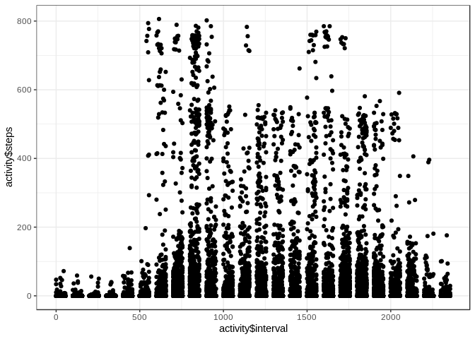
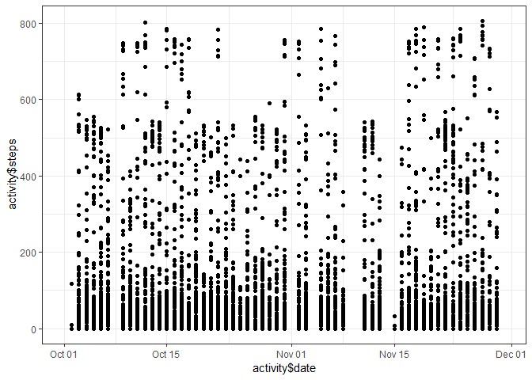
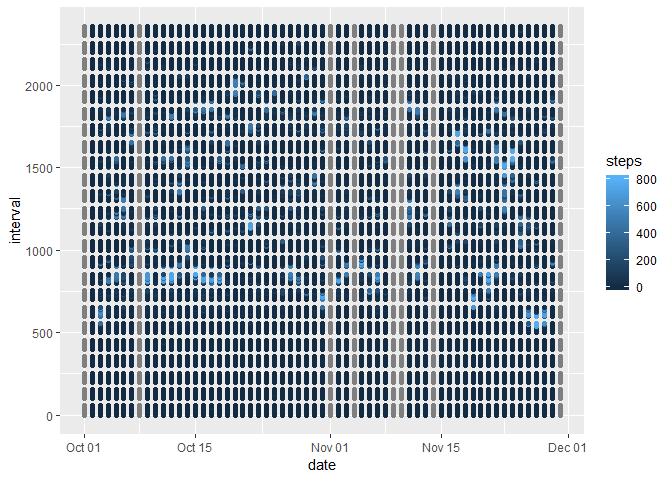

## Loading and preprocessing the data
Load data into correct format

* Check if activity.csv already exists, unpack if necessary

* using read_csv import data with correct data types

* look at the head of the data and summary to figure out basics


```r
if (!file.exists("./activity.csv"))
{
        unzip("./activity.zip")
}
library(readr)
activity <- read_csv("activity.csv", col_types = cols(date = col_date(format = "%Y-%m-%d"), 
    steps = col_number()))
head(activity)
```

```
## # A tibble: 6 x 3
##   steps date       interval
##   <dbl> <date>        <dbl>
## 1    NA 2012-10-01        0
## 2    NA 2012-10-01        5
## 3    NA 2012-10-01       10
## 4    NA 2012-10-01       15
## 5    NA 2012-10-01       20
## 6    NA 2012-10-01       25
```

```r
summary(activity)
```

```
##      steps             date               interval     
##  Min.   :  0.00   Min.   :2012-10-01   Min.   :   0.0  
##  1st Qu.:  0.00   1st Qu.:2012-10-16   1st Qu.: 588.8  
##  Median :  0.00   Median :2012-10-31   Median :1177.5  
##  Mean   : 37.38   Mean   :2012-10-31   Mean   :1177.5  
##  3rd Qu.: 12.00   3rd Qu.:2012-11-15   3rd Qu.:1766.2  
##  Max.   :806.00   Max.   :2012-11-30   Max.   :2355.0  
##  NA's   :2304
```
Provide a guick look at steps destibution:

* by interval

* day

* both


```r
library(ggplot2)
qplot(activity$interval,activity$steps)
```

```
## Warning: Removed 2304 rows containing missing values (geom_point).
```

<!-- -->

```r
qplot(activity$date,activity$steps)
```

```
## Warning: Removed 2304 rows containing missing values (geom_point).
```

<!-- -->

```r
x <- ggplot(data = activity, mapping = aes(x=date, y=interval, col=steps))
x+geom_point()
```

<!-- -->

## What is mean total number of steps taken per day?


## What is the average daily activity pattern?


## Imputing missing values


## Are there differences in activity patterns between weekdays and weekends?
