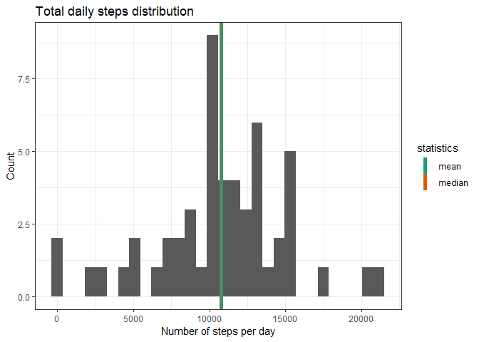

## Loading and preprocessing the data
Load data into correct format

* Check if activity.csv already exists, unpack if necessary

* using read_csv import data with correct data types

* look at the head of the data and summary to figure out basics


```r
if (!file.exists("./activity.csv"))
{
        unzip("./activity.zip")
}
library(readr)
activity <- read_csv("activity.csv", col_types = cols(date = col_date(format = "%Y-%m-%d"), 
    steps = col_number()))
head(activity)
```

```
## # A tibble: 6 x 3
##   steps date       interval
##   <dbl> <date>        <dbl>
## 1    NA 2012-10-01        0
## 2    NA 2012-10-01        5
## 3    NA 2012-10-01       10
## 4    NA 2012-10-01       15
## 5    NA 2012-10-01       20
## 6    NA 2012-10-01       25
```

```r
summary(activity)
```

```
##      steps             date               interval     
##  Min.   :  0.00   Min.   :2012-10-01   Min.   :   0.0  
##  1st Qu.:  0.00   1st Qu.:2012-10-16   1st Qu.: 588.8  
##  Median :  0.00   Median :2012-10-31   Median :1177.5  
##  Mean   : 37.38   Mean   :2012-10-31   Mean   :1177.5  
##  3rd Qu.: 12.00   3rd Qu.:2012-11-15   3rd Qu.:1766.2  
##  Max.   :806.00   Max.   :2012-11-30   Max.   :2355.0  
##  NA's   :2304
```
Provide a guick look at steps destibution:

* by interval

* day

* both


```r
library(ggplot2)
qplot(activity$interval,activity$steps)+theme_bw()
```

```
## Warning: Removed 2304 rows containing missing values (geom_point).
```

<!-- -->

```r
qplot(activity$date,activity$steps)+theme_bw()
```

```
## Warning: Removed 2304 rows containing missing values (geom_point).
```

<!-- -->

```r
x <- ggplot(data = activity, mapping = aes(x=date, y=interval, col=steps))
x+geom_point()+theme_bw()
```

<!-- -->

## What is mean total number of steps taken per day?

For this part of the assignment, you can ignore the missing values in the dataset.

1. Make a histogram of the total number of steps taken each day

2. Calculate and report the mean and median total number of steps taken per day

```r
daysteps<- aggregate(steps ~ date, activity, sum)
ggplot(daysteps, aes(x=steps))+ 
        geom_histogram()+labs(x="Number of steps per day", y="Count", title = "Total daily steps distribution")+
        geom_vline(aes(xintercept=mean(daysteps$steps, na.rm = TRUE), color="mean"), show.legend=TRUE, size=2)+
        geom_vline(aes(xintercept=median(daysteps$steps, na.rm = TRUE), color="median"), show.legend=TRUE)+
        scale_color_brewer(name="statistics", palette = "Dark2")+theme_bw()
```

```
## `stat_bin()` using `bins = 30`. Pick better value with `binwidth`.
```

<!-- -->

```r
mean(daysteps$steps, na.rm = TRUE)
```

```
## [1] 10766.19
```

```r
median(daysteps$steps, na.rm = TRUE)
```

```
## [1] 10765
```


## What is the average daily activity pattern?

1. Make a time series plot (i.e. type = "l") of the 5-minute interval (x-axis)
and the average number of steps taken, averaged across all days (y-axis)

```r
intervalsteps<- aggregate(steps ~ interval, activity, mean)
ggplot(data=intervalsteps, aes(x=interval, y=steps))+theme_bw()+geom_line()+
        labs(title = "Average steps by interval")
```

<!-- -->

2. Which 5-minute interval, on average across all the days in the dataset,
contains the maximum number of steps?


```r
intervalsteps[which.max(intervalsteps$steps),1]
```

```
## [1] 835
```


Bonus - comparison on average steps for interval with predicted average steps based on desision tree model.

```r
activityclear <- na.omit(activity)
activityclear$datenum <- as.numeric(activityclear$date)
activityclear <- activityclear[,-2]

library(party)
```

```
## Loading required package: grid
```

```
## Loading required package: mvtnorm
```

```
## Loading required package: modeltools
```

```
## Loading required package: stats4
```

```
## Loading required package: strucchange
```

```
## Loading required package: zoo
```

```
## 
## Attaching package: 'zoo'
```

```
## The following objects are masked from 'package:base':
## 
##     as.Date, as.Date.numeric
```

```
## Loading required package: sandwich
```

```r
library(reshape2)

cfit1 <- ctree(steps ~ ., data = activityclear[,-3])
activityclear$pred <- predict(cfit1,activityclear)

intervalsteps$pred <- predict(cfit1,intervalsteps)
interval_long <- melt(intervalsteps, id = "interval")  # convert to long format
```

```
## Warning: attributes are not identical across measure variables; they will
## be dropped
```

```r
ggplot(interval_long, aes(x = interval, y = value, colour = variable)) + 
        theme_bw()+geom_line()+labs(title = "Average steps per interval, actual and predicted by model")
```

<!-- -->

## Imputing missing values
Note that there are a number of days/intervals where there are missing values
(coded as NA). The presence of missing days may introduce bias into some
calculations or summaries of the data.

1. Calculate and report the total number of missing values in the dataset
(i.e. the total number of rows with NAs)

2. Devise a strategy for filling in all of the missing values in the dataset. The
strategy does not need to be sophisticated. For example, you could use
the mean/median for that day, or the mean for that 5-minute interval, etc.

3. Create a new dataset that is equal to the original dataset but with the
missing data filled in.

4. Make a histogram of the total number of steps taken each day and Calculate
and report the mean and median total number of steps taken per day. Do
these values differ from the estimates from the first part of the assignment?
What is the impact of imputing missing data on the estimates of the total
daily number of steps?


## Are there differences in activity patterns between weekdays and weekends?
For this part the weekdays() function may be of some help here. Use the dataset
with the filled-in missing values for this part.

1. Create a new factor variable in the dataset with two levels – “weekday”
and “weekend” indicating whether a given date is a weekday or weekend
day.

2. Make a panel plot containing a time series plot (i.e. type = "l") of the
5-minute interval (x-axis) and the average number of steps taken, averaged
across all weekday days or weekend days (y-axis). The plot should look
something like the following, which was creating using simulated data:
